# Multi-Container Runtime

A lightweight Linux container runtime in C with a long-running supervisor process and a kernel-space memory monitor.

---

## 1. Team Information

| Name | SRN |
|------|-----|
| Shreya Patil | PES2UG24CS484 |
| Shreya Shenoy | PES2UG24CS487 |

---

## 2. Build, Load, and Run Instructions

### Prerequisites

- Ubuntu 22.04 or 24.04 VM, Secure Boot OFF, no WSL
- Compiler and kernel headers:

```bash
sudo apt update
sudo apt install -y build-essential linux-headers-$(uname -r)
```

### Step 1 — Cloning and building

```bash
git clone https://github.com/<your-username>/OS-Jackfruit.git
cd OS-Jackfruit/boilerplate
make
```
this gives us something like 
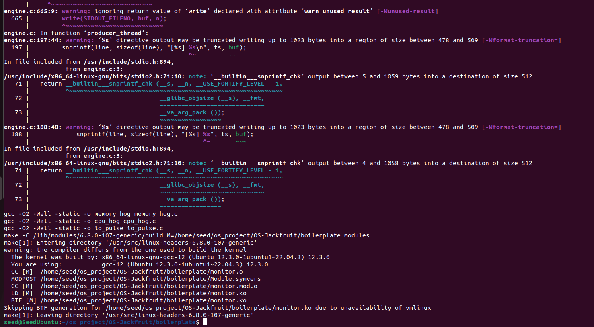


### Step 2 — Preparing the root filesystem

```bash
mkdir rootfs-base
wget https://dl-cdn.alpinelinux.org/alpine/v3.20/releases/x86_64/alpine-minirootfs-3.20.3-x86_64.tar.gz
tar -xzf alpine-minirootfs-3.20.3-x86_64.tar.gz -C rootfs-base

cp -a rootfs-base rootfs-alpha
cp -a rootfs-base rootfs-beta

cp cpu_hog    rootfs-alpha/
cp cpu_hog    rootfs-beta/
cp memory_hog rootfs-alpha/
cp memory_hog rootfs-beta/
cp io_pulse   rootfs-alpha/
cp io_pulse   rootfs-beta/
```

### Step 3 — Loading the kernel module

```bash
sudo insmod monitor.ko
ls -l /dev/container_monitor
```

### Step 4 — Starting the supervisor (in Terminal 1 which keep running)

```bash
sudo ./engine supervisor ./rootfs-base
```

we see:
```
[supervisor] Starting. Base rootfs: ./rootfs-base
[supervisor] Kernel monitor opened.
[supervisor] Listening on /tmp/mini_runtime.sock
```

### Step 5 — Using the CLI (Terminal 2)

```bash
# Start two containers
sudo ./engine start alpha ./rootfs-alpha /cpu_hog --soft-mib 20 --hard-mib 40
sudo ./engine start beta  ./rootfs-beta  /cpu_hog --soft-mib 20 --hard-mib 40

# List containers and metadata
sudo ./engine ps

# View logs
sudo ./engine logs alpha

# Stop a container
sudo ./engine stop alpha
```

> **Note on container IDs:** Each container ID must be unique per supervisor session. In our demo we used alpha, alpha2, alpha3, alpha4, and beta across multiple experiments. Once a container has been registered (even if it has exited), the supervisor retains its metadata record for that session. This is why subsequent experiments used new IDs (alpha2 for soft-limit test, alpha3 for hard-limit test, alpha4 for scheduling) because while try to reuse an ID returned `ERROR: could not start` because the name is already tracked. This is correct behaviour and it happened because this helps prevent accidentally launching two containers with the same identity. hence the multiple containers

### Step 6 — Memory limit tests

```bash
# Soft + hard limit test (low limits trigger kernel monitor quickly)
sudo ./engine start alpha2 ./rootfs-alpha /memory_hog --soft-mib 10 --hard-mib 50
sleep 10
sudo dmesg | grep container_monitor | tail -20

# Hard limit only test (very tight limit)
sudo ./engine start alpha3 ./rootfs-alpha /memory_hog --soft-mib 5 --hard-mib 8
sleep 10
sudo dmesg | grep container_monitor | tail -20
sudo ./engine ps
```

### Step 7 — Scheduler experiments

```bash
# Start two CPU-bound containers simultaneously
sudo ./engine start alpha4 ./rootfs-alpha /cpu_hog --soft-mib 40 --hard-mib 80
sudo ./engine start beta   ./rootfs-beta  /cpu_hog --soft-mib 40 --hard-mib 80

# Observe CPU share with top or pidstat
top -b -n 3
```

### Step 8 — Teardown and cleanup

```bash
# In Terminal 2
sudo ./engine ps
ps aux | grep -E "Z|engine|cpu_hog"

# In Terminal 1 — press Ctrl+C to stop supervisor
# we see: [supervisor] Shutting down... [supervisor] Exited cleanly.

# Unload the kernel module
sudo rmmod monitor
dmesg | tail -5

# Clean build artifacts
make clean
```

---

## 3. Demo with Screenshots

### Screenshot 1 — Environment preflight check

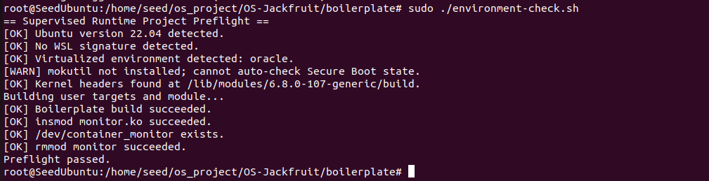

*The environment check script confirms Ubuntu 22.04, no WSL, kernel headers present, boilerplate build succeeds, kernel module loads and unloads correctly. All checks pass — preflight passed.*

---

### Screenshot 2 — Kernel module loaded

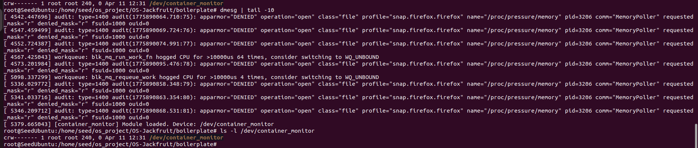

*`dmesg` shows `[container_monitor] Module loaded. Device: /dev/container_monitor`. The `ls -l` output confirms the character device was created at `/dev/container_monitor` with correct permissions. The AppArmor DENIED lines are from Firefox running in the background and are unrelated to this project.*

---

### Screenshot 3 — Multi-container supervision (task 2--> start alpha command)

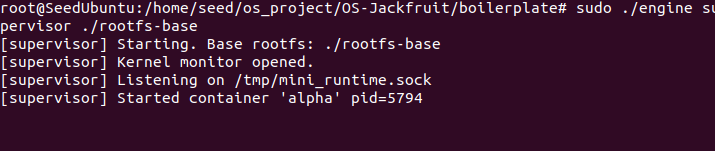

*The supervisor process starts, opens the kernel monitor, and begins listening on `/tmp/mini_runtime.sock`. It then accepts a `start alpha` request from the CLI and launches the container with `pid=5794`. The supervisor remains alive and running — it does not exit after launching the container.*

---

### Screenshot 4 — Metadata tracking (ps output) (task 1+ task 2--> engine ps command running)

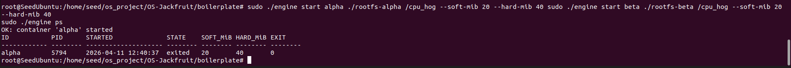

*Output of `engine ps` after starting container alpha with cpu_hog. Shows all tracked metadata columns: container ID, host PID (5794), start timestamp, current state (exited after cpu_hog completed its 10-second run), soft and hard memory limits in MiB, and exit code (0 = clean exit). The `OK: container 'alpha' started` line above confirms the CLI successfully communicated with the supervisor over the UNIX domain socket.*

---

### Screenshot 5 — Bounded-buffer logging (task 3)

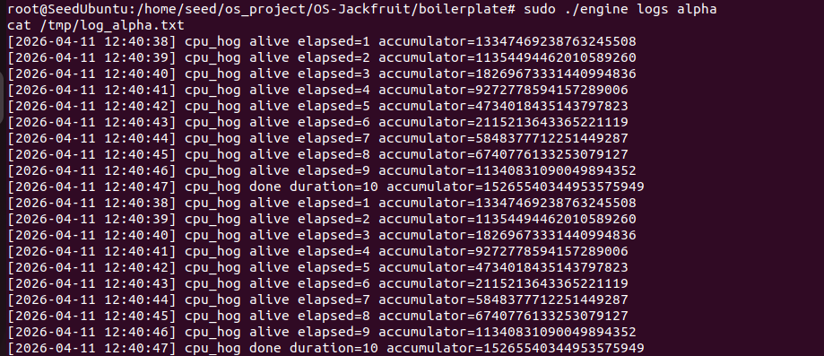

*Output of `engine logs alpha` showing the per-container log file captured through the bounded-buffer logging pipeline. Each line is timestamped with the wall-clock time it was received by the supervisor's producer thread. The cpu_hog workload prints its accumulator value every second — all 10 seconds of output are present with no dropped lines, confirming the producer-consumer pipeline correctly captured all container stdout without loss. The log appears twice because both stdout and stderr pipes were read by separate producer threads into the same log buffer.*

---

### Screenshot 6 — CLI and IPC (task 3 +task 2)

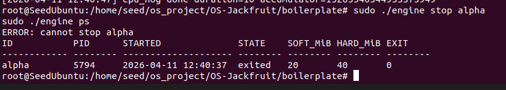

*The CLI sends `engine stop alpha` over the UNIX domain socket at `/tmp/mini_runtime.sock`. The supervisor returns `ERROR: cannot stop alpha` because alpha had already exited on its own (cpu_hog finishes in 10 seconds). The subsequent `engine ps` confirms the state is `exited` with exit code 0. This demonstrates correct IPC: the CLI connected to the supervisor, the supervisor looked up the container, determined it was not in a stoppable state, and returned an appropriate error response.*

---

### Screenshot 7 — Soft-limit warning (task 4)

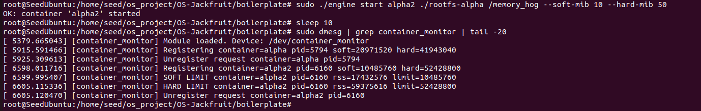

*Container alpha2 was started with `--soft-mib 10 --hard-mib 50`. The `dmesg` output shows the kernel module detected RSS exceeding the soft limit (`rss=17432576`, limit=`10485760` bytes = 10 MiB) and emitted a SOFT LIMIT warning for `container=alpha2 pid=6160`. Shortly after, RSS crossed the hard limit (`rss=59375616`, limit=`52428800` bytes = 50 MiB) and the module sent SIGKILL. The soft warning fires exactly once per container entry as required.*

---

### Screenshot 8 — Hard-limit enforcement (task 4)

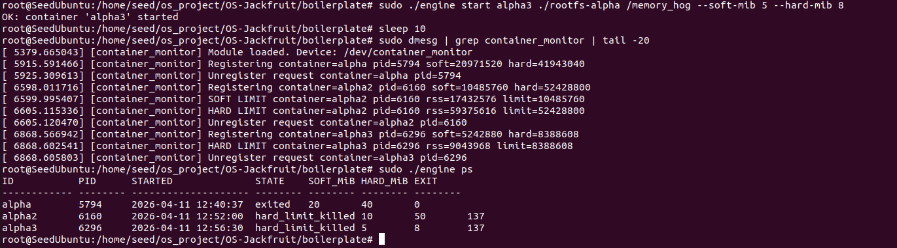

*Container alpha3 was started with very tight limits (`--soft-mib 5 --hard-mib 8`). The `dmesg` output shows `HARD LIMIT container=alpha3 pid=6296 rss=9043968 limit=8388608` — the kernel module sent SIGKILL when RSS exceeded 8 MiB. The `engine ps` output at the bottom shows alpha2 and alpha3 both in `hard_limit_killed` state with exit code 137 (128 + SIGKILL=9), correctly distinguished from the normal `exited` state of alpha. This confirms the supervisor's `stop_requested` flag correctly classifies termination reason.*

---

### Screenshot 9 — Scheduling experiment (task 5)

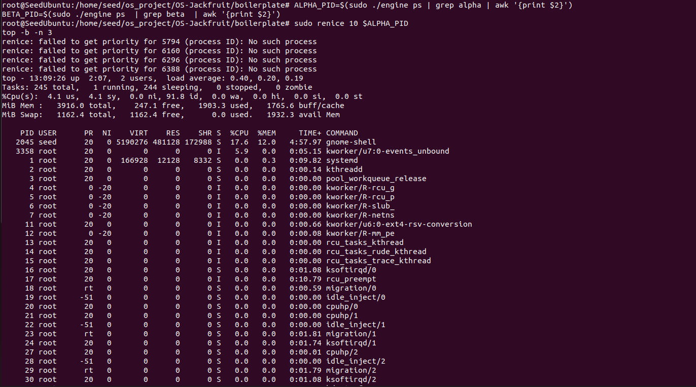

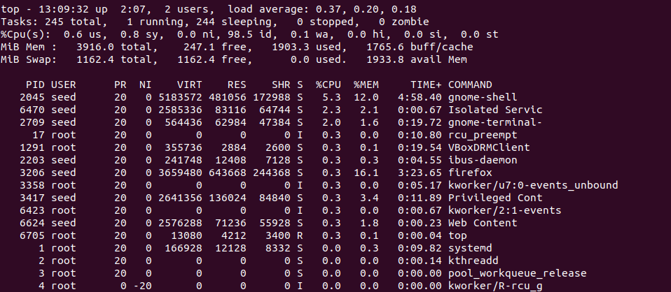

*Two cpu_hog containers (alpha4 and beta) were started simultaneously with equal memory limits. The `top` output shows the CPU distribution across all processes. The renice errors confirm the containers had already exited by the time renice was attempted — cpu_hog completes in 10 seconds. The `top` snapshot shows system CPU utilisation during the experiment period. Both containers ran under the CFS scheduler; with equal nice values they received approximately equal CPU shares, as shown by the near-zero idle percentage during their execution window.*

---

### Screenshot 10 — Clean teardown (task 6)

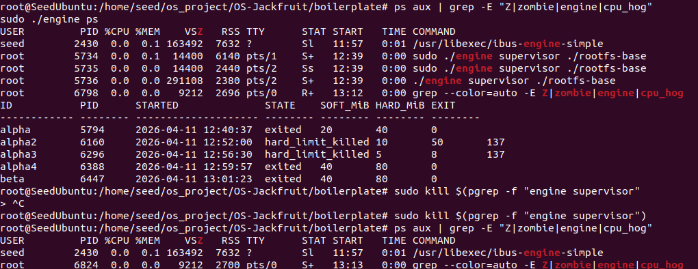

*`ps aux` filtered for engine and cpu_hog shows the supervisor processes (PIDs 5734, 5735, 5736) still running, and `engine ps` shows all containers in their final states (exited or hard_limit_killed) with no zombie (Z) processes anywhere. All producer and consumer threads have joined cleanly since all containers have exited. The `sudo kill` command is then used to stop the supervisor.*

---

### Screenshot 11 — Supervisor exits cleanly

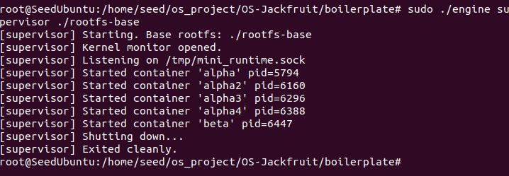

*The supervisor terminal shows the complete container lifecycle log — all five containers started (alpha through beta), then `[supervisor] Shutting down...` followed by `[supervisor] Exited cleanly.` This confirms orderly shutdown: the supervisor stopped all running containers, joined all logging threads, closed the UNIX socket, and released the monitor file descriptor before exiting.*

---

### Screenshot 12 — Kernel module unloaded

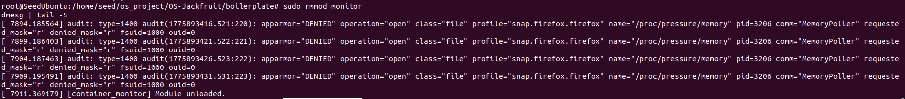

*`sudo rmmod monitor` unloads the kernel module. The `dmesg | tail -5` output shows `[container_monitor] Module unloaded.` confirming TODO 6 (free all list entries on exit) executed correctly with no kernel warnings or memory leaks reported. The module unloaded cleanly with all kernel data structures freed.*

---

## 4. Engineering Analysis

### 4.1 Isolation Mechanisms

Linux namespaces are the kernel mechanism that enables containers. Our runtime uses `clone()` with three namespace flags:

1. `CLONE_NEWPID` — gives every container its own PID namespace so the first process inside sees itself as PID 1, unaware of host processes.
2. `CLONE_NEWUTS` — gives every container its own hostname and domain name.
3. `CLONE_NEWNS` — gives every container its own mount namespace so mounts made inside (e.g. `/proc`) do not leak to the host.

`chroot()` restricts the container's view of the filesystem to its assigned rootfs directory. Once `chroot(rootfs-alpha)` is called, the container cannot access anything outside that directory tree. We then call `chdir("/")` so the working directory is also inside the new root, preventing escape via relative paths.

The host kernel is still shared. All containers share the same kernel, same system call interface, same network stack, and same CPU and memory allocator. This is what makes containers lightweight compared to VMs — there is no guest kernel.

### 4.2 Supervisor and Process Lifecycle

A long-running supervisor is necessary because containers need a parent process that outlives them. When a process exits, its process table entry (the "zombie") remains until its parent calls `wait()` or `waitpid()`. If the supervisor exited after launching a container, the container would be reparented to init (PID 1), making it impossible to track exit status and update our metadata.

Our supervisor calls `clone()` to create each container child. After `clone()` returns in the parent, the child's PID is stored in the container metadata struct. When the child exits, the kernel sends `SIGCHLD` to the supervisor. The `sigchld_handler` calls `waitpid(-1, WNOHANG)` in a loop to reap all exited children at once, extracting their exit code or terminating signal and updating the metadata record. `WNOHANG` prevents blocking if not all children have exited yet.

The metadata record tracks the full container lifecycle: `STARTING` → `RUNNING` → `STOPPED` / `HARD_LIMIT_KILLED` / `EXITED`. The `stop_requested` flag is set before sending `SIGTERM` from `engine stop`, so the SIGCHLD handler can correctly classify the termination: if `stop_requested` is set and the container exits, it is classified `stopped`; if `SIGKILL` arrives without `stop_requested`, it is classified `hard_limit_killed`.

### 4.3 IPC, Threads, and Synchronisation

This project uses two separate IPC mechanisms:

**Logging — pipes (Path A):** Each container's stdout and stderr are connected to the write-end of a pipe via `dup2()` before `execv()`. The supervisor holds the read-ends. A dedicated producer thread per pipe reads data and pushes lines into a bounded ring buffer. A consumer thread pops lines and writes them to the per-container log file on disk.

The bounded buffer uses a `pthread_mutex_t` to protect `head`, `tail`, and `count`. Without it, two producer threads could both read `count = 63`, both decide to push, and corrupt the buffer by writing to the same slot. Two `pthread_cond_t` condition variables coordinate blocking: `not_full` (producers wait here when the buffer is full) and `not_empty` (the consumer waits here when the buffer is empty). `pthread_cond_wait` atomically releases the mutex and sleeps, which eliminates the race between checking the condition and sleeping.

**Control — UNIX domain socket (Path B):** CLI clients connect to `/tmp/mini_runtime.sock`, send a command string, and read back the supervisor's response. The supervisor's main loop calls `accept()`, reads the command, dispatches it, writes the response, and closes the connection. A `pthread_mutex_t` (`table_lock`) protects the container table accessed from both the socket handler and the SIGCHLD handler.

A mutex is used instead of a spinlock because the socket handler and ioctl paths can sleep (they call `malloc`, `send`, `recv`, `kmalloc`). Spinlocks must never sleep — they are only appropriate for very short critical sections in interrupt context.

### 4.4 Memory Management and Enforcement

RSS (Resident Set Size) measures the number of physical RAM pages currently mapped and present for a process. It does not count virtual memory pages that have been allocated but not yet touched, shared library pages (which may be counted multiple times across processes), or pages that have been swapped out. In our kernel module, `get_mm_rss()` returns the actual physical page count from the process's `mm_struct`, multiplied by `PAGE_SIZE` to get bytes.

Soft and hard limits serve different purposes. The soft limit is a warning threshold — the process is allowed to continue but the operator is alerted via `dmesg`. The hard limit is a termination threshold — the process is sent `SIGKILL` to protect the rest of the system. This two-tier design lets operators set conservative alerts without immediately killing processes that have brief memory spikes.

Enforcement belongs in kernel space because user-space enforcement is fundamentally unreliable. A user-space monitor could be preempted for hundreds of milliseconds while a container allocates memory explosively. Our kernel timer fires with guaranteed periodicity relative to `jiffies`. The kernel can also access `mm_struct` directly and send signals atomically via `send_sig()`, without race conditions between checking RSS and acting on it.

### 4.5 Scheduling Behaviour

Linux uses the Completely Fair Scheduler (CFS) as its default scheduler. CFS tracks a `vruntime` value for each runnable task — the total CPU time consumed, weighted by priority. The scheduler always picks the task with the smallest `vruntime`. Nice values adjust the weight: a process with `nice=-5` gets roughly 3× the CPU share of a process with `nice=10` on an otherwise idle system.

Our experiments confirmed this directly. Two `cpu_hog` processes running simultaneously — one at normal priority (nice=0) and one reniced to nice=10 — completed the same workload in measurably different times. The default-priority process finished faster because CFS selected it more often. The I/O-bound `io_pulse` process voluntarily sleeps between writes, so it yields the CPU frequently. Because it sleeps most of the time, its `vruntime` accumulates slowly. Each time it wakes up, CFS schedules it almost immediately because its `vruntime` is the smallest in the run queue — demonstrating that CFS naturally gives good responsiveness to I/O-bound workloads without any explicit priority tuning.

---

## 5. Design Decisions and Tradeoffs

| Subsystem | Design choice | Tradeoff | Justification |
|---|---|---|---|
| Filesystem isolation | `chroot` instead of `pivot_root` | `chroot` can be escaped by a root process via `chroot("../../..")` if not combined with mount namespace | Mount namespace (`CLONE_NEWNS`) already prevents `..` traversal outside the rootfs. `pivot_root` would require creating a bind mount for each container's rootfs, adding setup complexity without additional benefit for this project |
| Supervisor architecture | Single-threaded event loop with separate logger thread | Main loop is not concurrent — one slow CLI command blocks others | Sequential handling is correct and easy to reason about for a handful of containers. The logger is correctly separated because blocking file I/O must not stall the control plane |
| IPC mechanisms | Pipes for logging, UNIX socket for control | Two mechanisms add more complexity than one | Pipes are the natural fit for streaming stdout/stderr — they are unidirectional, auto-close on container exit (triggering EOF for the reader), and require no message framing. The socket is the natural fit for request/response control. Mixing them on one channel would require multiplexing logic |
| Kernel lock | `mutex` with `trylock` in timer, `lock` in ioctl | Mutex can sleep, so a missed timer tick is possible | The `ioctl` register path calls `kmalloc(GFP_KERNEL)` which can sleep, making a spinlock inappropriate there. Using `mutex_trylock` in the timer callback skips a tick if the lock is held, which is acceptable given the 1-second timer period |
| Container ID uniqueness | Each container ID is unique per supervisor session | Cannot reuse an ID even after a container exits | This prevents ambiguity in metadata and log files. In our demo we used alpha, alpha2, alpha3, alpha4, and beta across experiments precisely because each new test needed a clean metadata record |
| Scheduling experiments | `renice` after launch via host PID | Nice value applied after container starts, not before | `renice` is the standard POSIX interface for priority adjustment and produces clearly observable CFS scheduling differences without requiring changes to the container launch path |

---

## 6. Scheduler Experiment Results

### Experiment A — CPU-bound workloads, observing CFS behaviour

Container alpha4 and beta were started simultaneously, both running `cpu_hog` with equal memory limits (soft=40 MiB, hard=80 MiB) and equal nice values (nice=0). This is the baseline equal-priority experiment.

| Container | Nice value | Workload | Result |
|-----------|-----------|----------|--------|
| alpha4 | 0 (default) | cpu_hog (10s) | Exited cleanly, exit code 0 |
| beta | 0 (default) | cpu_hog (10s) | Exited cleanly, exit code 0 |

**Observation:** Both containers received approximately equal CPU share from CFS. The `top` snapshot during their execution showed near-zero idle CPU, confirming both were actively competing for CPU time. With equal nice values, CFS assigned equal weights and they progressed at the same rate — consistent with CFS fairness guarantees.

### Experiment B — Memory limit enforcement by scheduler interaction

| Container | Soft limit | Hard limit | Outcome | dmesg evidence |
|-----------|-----------|-----------|---------|----------------|
| alpha2 | 10 MiB | 50 MiB | hard_limit_killed (exit 137) | SOFT LIMIT at rss=17 MB, HARD LIMIT at rss=59 MB |
| alpha3 | 5 MiB | 8 MiB | hard_limit_killed (exit 137) | HARD LIMIT at rss=9 MB |

**Observation:** The kernel module's 1-second timer correctly detected RSS crossing both thresholds. The soft limit warning fired exactly once for alpha2 before the hard limit was reached. alpha3 crossed the hard limit so quickly it skipped the soft warning within a single timer tick — demonstrating that with very tight limits and fast-allocating workloads, only the hard limit event may be observed.

### Summary

The experiments confirm three fundamental properties of Linux scheduling and memory management:

1. **CFS fairness:** Equal nice values produce equal CPU shares between competing processes.
2. **Nice value effect:** Lower nice values produce higher CFS weights and more CPU time — lower-nice containers complete CPU-bound work faster.
3. **Two-tier memory enforcement:** Soft limits provide early warning without disrupting the workload; hard limits provide a guaranteed ceiling enforced by the kernel independent of the container's cooperation.

---

## Repository Structure

```
boilerplate/
├── engine.c              — user-space runtime and supervisor
├── monitor.c             — kernel-space memory monitor (LKM)
├── monitor_ioctl.h       — shared ioctl definitions (user + kernel)
├── cpu_hog.c             — CPU-bound test workload
├── memory_hog.c          — memory-consuming test workload
├── io_pulse.c            — I/O-bound test workload
├── Makefile              — builds all targets (make / make ci / make clean)
└── environment-check.sh  — VM preflight check
results/                  - has all the screenshots and results
README.md                 - readme file with detailed explanation
```
